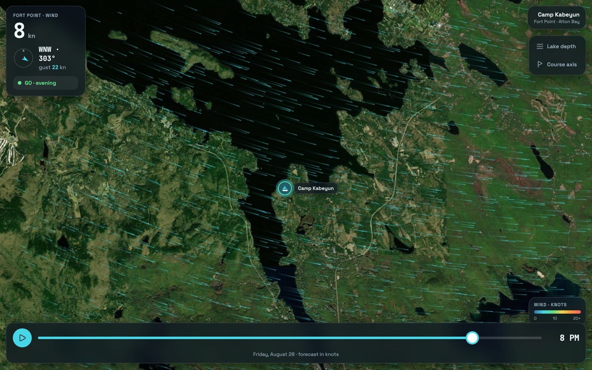
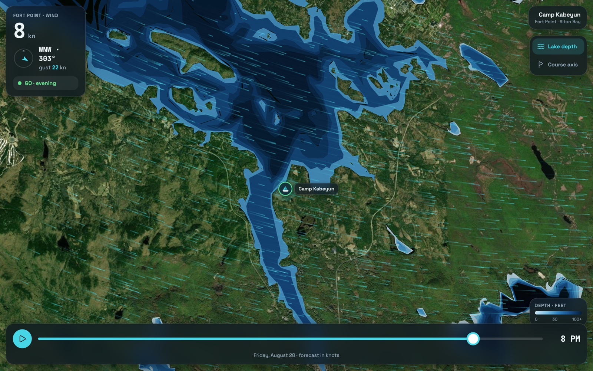

# Camp Kabeyun Wind

**A daily sailing brief and live wind map for Alton Bay, Lake Winnipesaukee.** Every morning at 6am ET it blends five weather models into one forecast, calls GO / CAUTION / NO-GO for each of the day's three sailing periods, and posts it to Slack.

I built it while running the sailing department at Camp Kabeyun. Every morning I had to decide the same three things before instructors got to the waterfront — do we sail, which boats go out, and is there lightning coming. Answering that meant opening four forecast sites, none of which agreed, none of which knew that Alton Bay sits in a wind shadow, and none of which told me the one thing I actually needed: *is this a day for beginners in Optis, or a day to keep them ashore.*

So the brief doesn't report weather. It reports a decision.

**Live:** [wind-map.vercel.app](https://wind-map.vercel.app)



## The morning brief

This is the real message from the endpoint today — thunderstorm banner, per-window verdicts, model agreement, and the reaction prompt that feeds the calibration loop:

```
⛵ Camp Kabeyun — Wind & Weather Brief
Fort Point, Alton Bay · Friday, August 28
⚠️ Thunderstorms in the forecast today — watch the holds below.

✅ Morning (9:30–12) — GO
    WNW 2–5 kn (g14) · dry · clean breeze, good for all levels

🟡 Afternoon (3–5pm) — CAUTION
    W 3–5 kn (g16) · ⚡ t-storms 25% · ⚡ storms possible — be ready to clear the water fast

✅ Evening (7–8:30pm) — GO
    WNW 5–8 kn (g22) · dry · clean breeze, good for all levels

🌡️ 71–80°F  ·  📊 ✅ models in close agreement
🗺️ Tap for live map: Alton Bay — wind · depth · course spots
Sources: NWS + HRRR + ECMWF + ICON + GFS.  React to calibrate:  👍 spot-on · 💨 windier · 😴 calmer
```

The three windows aren't arbitrary hours — they're the camp's actual activity periods. A forecast for 2pm is useless when nobody is on the water at 2pm.

## How the forecast works

**Five models, weighted.** NWS, HRRR, ECMWF, ICON, and GFS are fetched concurrently and blended into one "most likely" value per variable. Weights re-normalize over whichever sources actually responded, so losing a source degrades the forecast instead of breaking it.

| Source | Weight | Why |
|---|---|---|
| NWS | .30 | Official, human-adjusted, thunder-aware |
| HRRR | .30 | 3km resolution — best at local terrain effects |
| ECMWF | .20 | Strongest global model |
| ICON | .12 | Independent European signal |
| GFS | .08 | Baseline, worst local resolution |

Wind direction is averaged as vectors, not numbers — averaging 350° and 10° arithmetically gives you 180°, which is exactly backwards.

**Confidence comes from disagreement.** Rather than projecting false precision, the system measures the spread between per-source window means. Under 3 knots reports "models in close agreement"; over 6 knots the brief says the models differ and to treat the day as uncertain. A forecast that tells you when to distrust it is more useful than one that doesn't.

**Hazards are asymmetric on purpose.** Three rules encode that being wrong in one direction is much worse than the other:

- Rain probability is never allowed below the official NWS number, even when four other models are drier.
- Thunder votes count only from storm-aware sources (NWS forecast text, HRRR weather codes) — the global models aren't trusted to resolve convection.
- The learned calibration bias adjusts sustained wind only. It never touches the thunder rules or the gust thresholds, and since it's clamped to ±3 knots while the gap between the NO-GO and GO thresholds is 6, it cannot move a day from NO-GO to GO.

**The map and the brief cannot disagree.** Both read from one shared `/api/forecast` endpoint. An earlier version computed them separately and they drifted — see below.

## Calibration from Slack reactions

Each brief asks for a reaction: 👍 spot-on, 💨 windier than forecast, 😴 calmer. The next morning's run reads reactions off the last six briefs and folds them into a wind bias in knots, weighting recent days more heavily (0.6 exponential decay) and clamping the total to ±3 knots so no run of bad days can wreck the forecast.

The interesting part is where the state lives: **nowhere.** There's no database. Slack messages already store their own reactions, so the message history *is* the training data. `conversations.history` returns everything the loop needs, which means the whole system is stateless and there is no storage to provision, migrate, or pay for.

## Lake depth and course placement

Winnipesaukee is full of unmarked shoals, and where you can safely set a race mark depends entirely on depth. The map carries the bay's bathymetry as an overlay.



Those same polygons do second duty as a shoreline mask. The **course axis** overlay searches outward from camp for the longest windward/leeward beat whose two marks both sit in genuinely open water — 80 metres of clearance in every direction — and rotates it to the forecast wind for the hour you're scrubbed to. If no axis fits, it draws nothing rather than putting a mark on the beach.

## Rewriting v1

The first version (`weather_alert.py`, still in this repo) was Python on a GitHub Actions cron: four sources, a flat average, a Claude-generated prose summary, and a `history.json` committed back to the repo after every run as its memory.

Three things pushed a rewrite:

1. **A flat average is the wrong model.** Treating GFS and HRRR as equally credible at a 3km-scale terrain problem throws away the thing that makes HRRR worth having.
2. **The map and the brief computed forecasts separately** and disagreed with each other — the exact bug the shared endpoint now makes impossible.
3. **`git commit` is not a database.** Every run wrote a file and pushed it. Reading reactions back out of Slack removed the persistence layer entirely.

The v1 cron also fired at a fixed `0 10 * * *` UTC, which silently becomes 5am once EST starts. The current version fires at both 10:00 and 11:00 UTC and posts only when it's actually 6am in New Hampshire — cron has no concept of daylight saving, so the guard has to live in the handler.

I kept v1 in the repo rather than deleting it. The diff between the two is the honest record of what I learned.

## Repo layout

```
wind-map/                  # current system (Vercel)
  lib/config.js            # single source of truth — weights, windows, thresholds
  lib/forecast.js          # 5-model ensemble, confidence, verdict rules
  lib/learn.js             # reaction-based calibration (stateless)
  api/forecast.js          # shared endpoint — map + brief both read this
  api/daily-brief.js       # 6am Slack post, DST-guarded
  index.html               # Leaflet map, wind particles, depth + course overlays
  bathy.geojson            # Alton Bay bathymetry

weather_alert.py           # v1 — superseded, kept as a record
fetchers/                  # v1 source adapters
claude_summarizer.py       # v1 prose summaries
```

Every verdict threshold lives in `config.js` as a named constant rather than scattered through the logic, so tuning the system after a season on the water is a one-file change.

## Known limitations

- **Course placement uses a shoreline mask, not a depth check.** The bathymetry around camp resolves only into 20-foot bands (0–20, 20–40), which can't identify good holding ground — so the course layer no longer claims to. Actual depth under each mark is unverified; check the depth overlay before dropping an anchor.
- **No automated tests.** For a single-user tool this was a deliberate trade; it's the first thing I'd add before anyone else depended on it.
- **The calibration loop currently reports a bias of 0.** That's correct behavior for accurate forecasts, but it's indistinguishable from the loop not running, which is a gap in the instrumentation.
- **Alton Bay sits in a wind shadow** and typically reads 20–30% lower than the Broads. The models don't know this; I do, and I read the map accordingly. Encoding that correction is unfinished work.

## Running it

```bash
cd wind-map && vercel dev
```

Set `SLACK_WEBHOOK_URL` (or `SLACK_BOT_TOKEN`) to post, and `CRON_SECRET` to protect the cron route. Forecast sources need no keys. Preview the brief without posting:

```bash
curl "localhost:3000/api/daily-brief?preview=1"
```

## Notes

Built with heavy AI assistance — the commit history has the co-authorship trailers to show it. The forecast design, the weighting, the safety rules, and the decision to treat Slack as the datastore are mine; a lot of the typing wasn't.

Written for one user, running daily since summer 2026.
